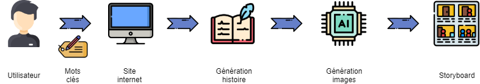
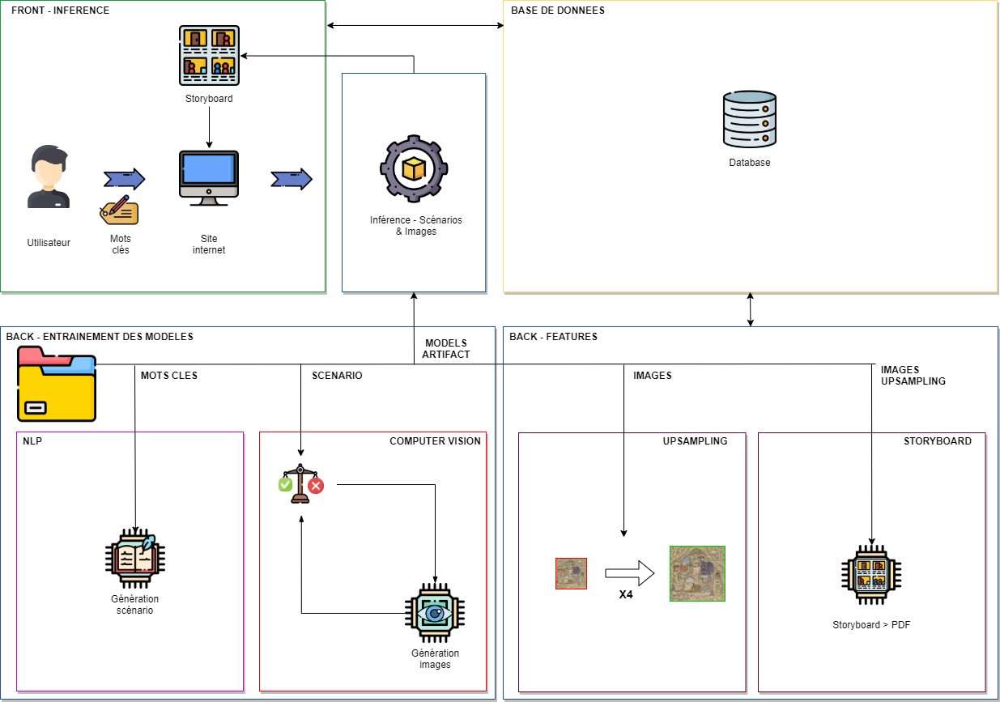
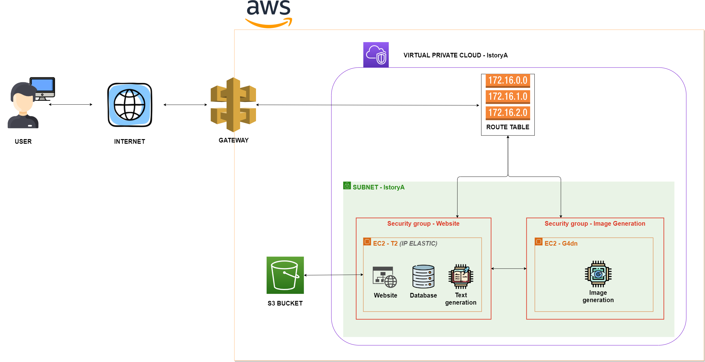

# IstoryA-project- Annual project ESGI 5IABD
This project is a school project for ESGI (Paris).

The aim of this project, is to create a website where user can generate a story, then generate images from this story and finaly build a Storyboard with text and image.

This project is hosted on an Html/Css Website, and available on AWS at this adress :  http://13.37.83.253/

## Architecture & Code :
This repo contains Website source code, datasets, exploration notebooks and flask server root config 

#### Fonctionnal Application :

***********************************

#### Technical Local Architecture :

***********************************

#### Technical Cloud Architecture

***********************************

## How to run :

## Authors : 

Clément Delaunay (https://github.com/Koneko76)

Florian Bergeron (https://github.com/FlorianBergeron)

Clément Depraz (https://github.com/clement-depraz)

Mathias Gianotti (https://github.com/Mathiris)

